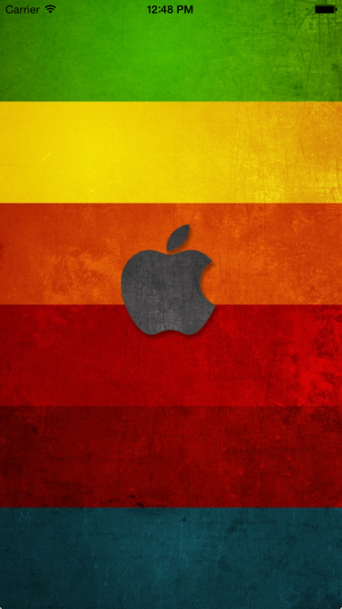
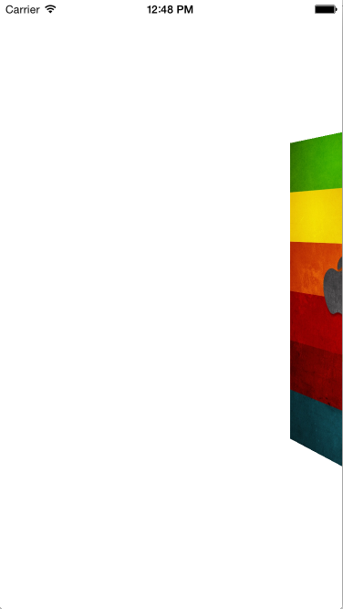

# Airbnb Menu's Airview Animation

## Overview

Airbnb Menu's Airview Animation is a drop-in easy-to-use library<br>
that provides a simple way to integrate a 3D UIView animation<br>
just like Airbnb's last updated Airview menu into your iOS applications. 




## Working with the Library

To Animate, ALL you need is to call<br>

```objc
[self airviewAnimate];
```

and to Reverse Animate, you just need to call<br>

```objc
[self airviewBack];
```
